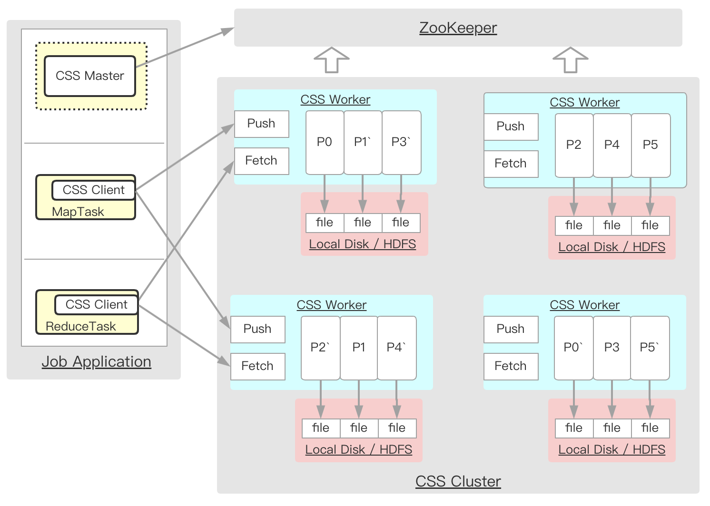

English | **[简体中文](README_zh.md)**
# Cloud Shuffle Service

[](https://github.com/bytedance/ByteX/blob/master/LICENSE)

Cloud Shuffle Service(CSS) is a general purpose remote shuffle solution for compute engines, including Spark/Flink/MapReduce.
It provides reliable, high-performance, and elastic data shuffling capabilities to these compute engines.
Shuffled data is pushed to the CSS cluster, stored in disk or HDFS, and can be fetched from the CSS cluster by compute engines.


- CSS Worker 

  Stores shuffled data that is pushed from map tasks in memory and persist them to file system asynchronously, allowing reduce tasks to subsequently fetch data from CSS workers.

- CSS Master
  
  CSS Master is a coordinator component for an application's shuffle process, and is integrated into the application. It reads CSS worker list from ZooKeeper and assigns them to the application to do shuffling, tracks the progress of running map tasks, and then notifies CSS workers to commit files after all the map tasks have finished.

- CSS Client

  Map/Reduce task use CSS client to push/fetch shuffled data to the assigned CSS workers.

## Building CSS

### mvn build

CSS is built using [Apache Maven](https://maven.apache.org/). Building CSS using Maven requires Java 8 and either Scala 2.12 or Scala 2.11.

```bash
mvn -DskipTests clean package
```
### Building a Runnable Distribution
To create a CSS distribution, use ./build.sh in the project root directory.
```bash
./build.sh
```
It generates a tgz package, you can copy it to the nodes you want to deploy CSS.
```
css-1.0.0-bin
├── LICENSE
├── README.md
├── client
├── conf
├── docs
├── lib  // CSS cluster lib
└── sbin
```

## Deploy CSS Cluster
CSS provides two deployment modes, standalone and zookeeper mode.
The standalone mode is currently only for testing,
while the zookeeper mode is used in the production environment.

1. Place the above built CSS tgz file on each node of the Cluster.
2. Unpack it to a dir, which can be set to CSS_HOME environment, all default conf, metrics and workers list can be found in the ```$CSS_HOME/conf``` directory.
3. Update ```$CSS_HOME/sbin/css-config.sh```.
   ```
   # standalone mode
   CSS_MASTER_HOST=<HOST_IP>
   MASTER_JAVA_OPTS="-Xmx8192m"
   WORKER_JAVA_OPTS="-Xmx8192m -XX:MaxDirectMemorySize=100000m"
    
   # zookeeper mode
   WORKER_JAVA_OPTS="-Xmx8192m -XX:MaxDirectMemorySize=100000m"
   ```
4. Update ```$CSS_HOME/conf/css-defaults.conf```
   ```
   css.cluster.name = <css cluster name>

   # standalone(for testing) or zookeeper(for production)
   css.worker.registry.type = zookeeper
   # only for zookeeper mode
   css.zookeeper.address = <ip1>:<port1>,<ip2>:<port2>,<ip3>:<port3>
   
   # css worker common conf
   css.flush.queue.capacity = 4096
   css.flush.buffer.size = 128k
   css.network.timeout = 600s
   css.epoch.rotate.threshold = 1g
   css.push.io.numConnectionsPerPeer = 8
   css.push.io.threads = 128
   css.replicate.threads = 128
   css.fetch.io.threads = 64
   css.fetch.chunk.size = 4m
   css.shuffle.server.chunkFetchHandlerThreadsPercent = 400
   
   # hdfs storage
   css.hdfsFlusher.base.dir = hdfs://xxx
   css.hdfsFlusher.num = -1
   css.hdfsFlusher.replica = 2    
   
   # local disk storage
   css.diskFlusher.base.dirs = /data00/css,/data01/css
   css.disk.dir.num.min = 1
   ```
5. Define your metrics and worker node host in the following files:
   ```
   $CSS_HOME/conf/css-metrics.properties
   $CSS_HOME/conf/workers
   ```
6. Sync all the updated config files to each node of the Cluster.
7. Start the CSS Cluster Shuffle workers. The script will ssh into each css worker node and start the Workers.
   ```
   # standalone mode
   cd $CSS_HOME;bash ./sbin/start-all.sh
   # zookeeper mode
   cd $CSS_HOME;bash ./sbin/start-workers.sh
   ```

## Running with Spark
1. Copy ```$CSS_HOME/client/spark-${version}/*.jar``` to ```$SPARK_HOME/jars/``` .
2. Run spark with CSS.
   ```
   # standalone mode
   --conf spark.css.cluster.name=<css cluster name> \
   --conf spark.css.master.address=css://<masterIp>:<masterPort>\
   --conf spark.shuffle.manager=org.apache.spark.shuffle.css.CssShuffleManager\
   
   # zookeeper mode
   --conf spark.css.cluster.name=<css cluster name> \
   --conf spark.css.zookeeper.address="<ip1>:<port1>,<ip2>:<port2>,<ip3>:<port3>" \
   --conf spark.shuffle.manager=org.apache.spark.shuffle.css.CssShuffleManager\
   ```

## Spark Adaptive Query Execution Support
CSS supports all the features of AQE. To support skew join optimization, it is necessary to patch the file to Spark and re-build Spark.
```
./patch/spark-3.0-aqe-skewjoin.patch
```

## Configuration
### CSS Cluster Server
All detailed configuration can be found in the CssConf class.

| Property Name             | Default    | Meaning                                                                                                                           |
|---------------------------|------------|-----------------------------------------------------------------------------------------------------------------------------------|
| css.cluster.name          | -          | The cluster name for the CSS cluster.                                                                                             |
| css.worker.registry.type  | standalone | The worker registry type (e.g. standalone, zookeeper). This will also specify if CSS will run under Standalone or zookeeper mode. |
| css.zookeeper.address     | -          | (For zookeeper mode) The CSS zookeeper address.                                                                                   |
| css.push.io.threads       | 32         | The CSS Threads for netty push data io.                                                                                           |
| css.fetch.io.threads      | 32         | The CSS Threads for netty fetch data io.                                                                                          |
| css.commit.threads        | 128        | The CSS Threads for stage end to close partition file.                                                                            |
| css.diskFlusher.base.dirs | /tmp/css   | The CSS Disk Base dirs (e.g. /data00/css,/data01/css).                                                                            |
| css.hdfsFlusher.base.dir  | -          | The CSS HDFS Base dir (e.g. hdfs://xxx).                                                                                          |

### CSS Spark Client

| Property Name                             | Default | Meaning                                                                                                                                                                                                                           |
|-------------------------------------------|---------|-----------------------------------------------------------------------------------------------------------------------------------------------------------------------------------------------------------------------------------|
| css.max.allocate.worker                   | 1000    | The Maximum number of workers requested for shuffling.                                                                                                                                                                            |
| css.worker.allocate.extraRatio            | 1.5     | The application can allocate additional workers controlled by this extra ratio, the final number will be calculated with Min(Max(2, targetWorker), MaxAllocateWorker).                                                            |
| css.backpressure.enabled                  | true    | The back pressure control, when enabled, it will use Gradient2Limit to control push data rate, otherwise use FixedLimit.                                                                                                          |
| css.fixRateLimit.threshold                | 64      | Fixed Rate for the back pressure control.                                                                                                                                                                                         |
| css.data.io.threads                       | 8       | The Maximum client side data sending for netty thread.                                                                                                                                                                            |
| css.maxPartitionsPerGroup                 | 100     | The Maximum number of partitions per group, each data push will send one group at a time.                                                                                                                                         |
| css.partitionGroup.push.buffer.size       | 4m      | The Maximum buffer size sent per each data push, in the same format as JVM memory strings with a size unit suffix ("k", "m", "g" or "t") (e.g. 512m, 2g).                                                                         |
| css.client.mapper.end.timeout             | 600s    | The Maximum timeout to wait for all data to be sent before mapTask ends.                                                                                                                                                          |
| css.stage.end.timeout                     | 600s    | The Maximum timeout to wait for all partition files to close.                                                                                                                                                                     |
| css.sortPush.spill.record.threshold       | 1000000 | The Maximum records for sending data.                                                                                                                                                                                             |
| css.sortPush.spill.size.threshold         | 256m    | The Maximum size for sending data, in the same format as JVM memory strings with a size unit suffix ("k", "m", "g" or "t") (e.g. 512m, 2g).                                                                                       |
| css.shuffle.mode                          | DISK    | Choose which storage mode to use (e.g. DISK, HDFS).                                                                                                                                                                               |
| css.epoch.rotate.threshold                | 1g      | The file auto rotate switch threshold size for new files, in the same format as JVM memory strings with a size unit suffix ("k", "m", "g" or "t") (e.g. 512m, 2g).                                                                |
| css.client.failed.batch.blacklist.enabled | true    | When MapTask encounters onFailure, the current reduceId-epochId-mapId-mapAttemptId-batchId will be recorded into the blacklist. In AE skewjoin mode, this switch must be turned on, otherwise there will be correctness problems. |
| css.compression.codec                     | lz4     | It is recommended to use zstd compression mode. Compared with lz4, it can improve the compression ratio by 30%, and only consume an additional 8% of performance.                                                                 |

## Contribution

Please check [Contributing](CONTRIBUTING.md) for more details.

## Code of Conduct

Please check [Code of Conduct](CODE_OF_CONDUCT.md) for more details.

## Security

If you discover a potential security issue in this project, or think you may
have discovered a security issue, we ask that you notify Bytedance Security via our [security center](https://security.bytedance.com/src) or [vulnerability reporting email](mailto:sec@bytedance.com).

Please do **not** create a public GitHub issue.

## License

This project is licensed under the [Apache-2.0 License](LICENSE).